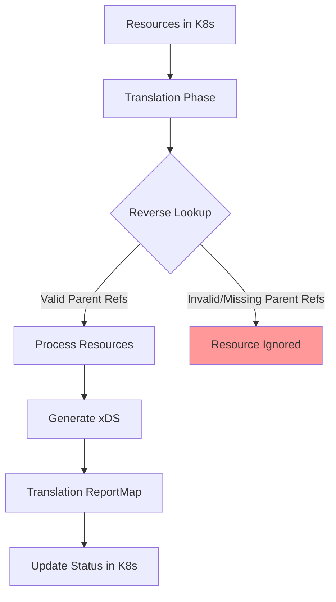
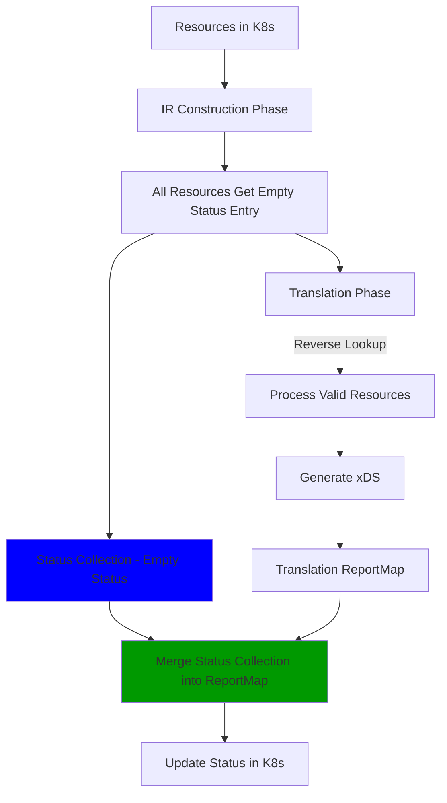
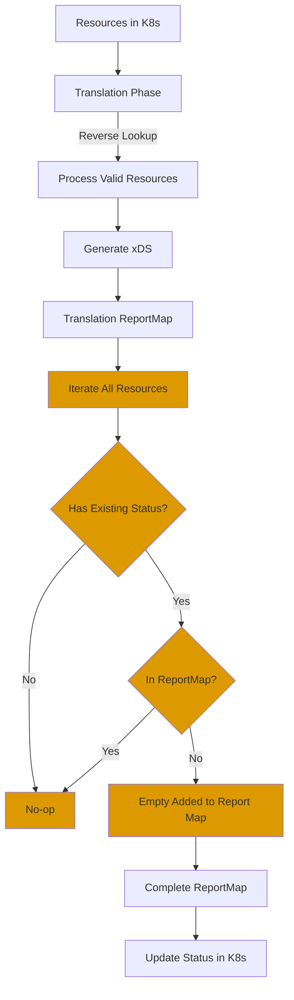

# EP-11747: Orphaned Resource Status Reporting

* Issue: [#11747](https://github.com/kgateway-dev/kgateway/issues/11747)
* Partially Resolve Issue: [#11402](https://github.com/kgateway-dev/kgateway/issues/11402)

## Background

Currently, status for Kgateway CRDs (HTTPRoutes, TrafficPolicies, etc.) are only reported at the end
of translation phase. Resources are processed through a reverse lookup mechanism where parent resources trigger
the discovery and processing of child resources. This approach works well for correctly configured resources but
leaves stale status for "orphaned" resources—resources that reference non-existent or invalid parent/target
references.

When a resource is orphaned (e.g., an HTTPRoute with all invalid `parentRefs`, or a TrafficPolicy with all
invalid `targetRefs`), it is never picked up during translation. As a result, the status from previous
configurations remains stale and is never cleared. Users can technically detect orphaned resources by observing
a mismatch between `observedGeneration` and the current generation in the status, but this requires subtle
prior knowledge of Kubernetes status semantics and is not the best user experience.

This problem affects user experience in several ways:
- Users see stale status from previous valid configurations, making it unclear the resource is now orphaned
- Troubleshooting becomes difficult as stale status can be misleading
- The behavior deviates from Kubernetes best practices

## Motivation

Ensuring status accurately reflects the current state by clearing stale status for orphaned resources

Other Kubernetes controllers provide status feedback for orphaned or misconfigured resources, however does not fit our
case perfectly:

- **Cilium** reports status on HTTPRoutes with invalid parent references
  ([docs](https://docs.cilium.io/en/stable/network/servicemesh/gateway-api/gateway-api/))
  - Potentially problematic given HTTPRoute is Gateway API resource and can refer to multiple controllers at same time
- **Cert-manager** validates and reports status on Issuer and Secret references
  ([docs](https://cert-manager.io/docs/troubleshooting/))
  - Own resource and not shared unlike HTTPRoute
- **Istio** provides detailed validation messages for VirtualServices with invalid references
  ([docs](https://istio.io/latest/docs/reference/config/analysis/ist0101/))
  - Own resource and not shared unlike HTTPRoute

### Goals

- Clear stale status for resources that become orphaned
- Maintain consistency with existing status reporting patterns
- Handle partial validity scenarios (some refs valid, some invalid) correctly
- Align with Gateway API and Kubernetes ecosystem best practices
- Minimize performance overhead of status management
- Only manage status owned by kgateway controller (respect controllerName)

### Non-Goals

- Change the core translation mechanism or reverse lookup approach
- Implement "pending" states that might confuse transient controller operations with user errors
- Validation of references
- Modify status owned by other controllers (respect controllerName boundaries)
- Modify the status syncer architecture significantly

## Implementation Details

### High-Level Design

The solution introduces **status clearing** using status collections during the intermediate representation (IR)
construction phase. Each resource with existing status condition gets an empty status entry in the status
collection at construction time, essentially marking them "dirty". After translation completes, the status
collection is merged with the translation ReportMap. This ensures orphaned resources have their stale status
updated and cleared, while valid resources have their status updated from translation.

### Status Condition Format

Following Gateway API conventions:

**For Orphaned Resources:**
```yaml
status:
  parents: []
  # Empty - stale status cleared
```

**For Valid References:**
```yaml
status:
  parents:
  - conditions:                                                                                                                                                                                                                                                                                                             
    - lastTransitionTime: "XXX"                                                                                                                                                                                                                                                                            
      message: Successfully accepted Route                                                                                                                                                                                                                                                                     
      observedGeneration: 1                                                                                                                                                                                                                                                                                                 
      reason: Accepted                                                                                                                                                                                                                                                                                             
      status: "True"                                                                                                                                                                                                                                                                                                       
      type: Accepted                                                                                                                                                                                                                                                                                                        
    - lastTransitionTime: "XXX"                                                                                                                                                                                                                                                                            
      message: Successfully resolved all references                                                                                                                                                                                                                                                                         
      observedGeneration: 1                                                                                                                                                                                                                                                                                                 
      reason: ResolvedRefs                                                                                                                                                                                                                                                                                                  
      status: "True"                                                                                                                                                                                                                                                                                                        
      type: ResolvedRefs                                                                                                                                                                                                                                                                                                    
    controllerName: kgateway.dev/kgateway                                                                                                                                                                                                                                                                                   
    parentRef:                                                                                                                                                                                                                                                                                                              
      group: gateway.networking.k8s.io                                                                                                                                                                                                                                                                                      
      kind: Gateway                                                                                                                                                                                                                                                                                                         
      name: example-gateway
```

**For Partial Validity (valid `example-gateway` and invalid `missing-gateway`):**
```yaml
status:
  parents:
  - conditions:                                                                                                                                                                                                                                                                                                             
    - lastTransitionTime: "XXX"                                                                                                                                                                                                                                                                            
      message: Successfully accepted Route                                                                                                                                                                                                                                                                     
      observedGeneration: 1                                                                                                                                                                                                                                                                                                 
      reason: Accepted                                                                                                                                                                                                                                                                                             
      status: "True"                                                                                                                                                                                                                                                                                                       
      type: Accepted                                                                                                                                                                                                                                                                                                        
    - lastTransitionTime: "XXX"                                                                                                                                                                                                                                                                            
      message: Successfully resolved all references                                                                                                                                                                                                                                                                         
      observedGeneration: 1                                                                                                                                                                                                                                                                                                 
      reason: ResolvedRefs                                                                                                                                                                                                                                                                                                  
      status: "True"                                                                                                                                                                                                                                                                                                        
      type: ResolvedRefs                                                                                                                                                                                                                                                                                                    
    controllerName: kgateway.dev/kgateway                                                                                                                                                                                                                                                                                   
    parentRef:                                                                                                                                                                                                                                                                                                              
      group: gateway.networking.k8s.io                                                                                                                                                                                                                                                                                      
      kind: Gateway                                                                                                                                                                                                                                                                                                         
      name: example-gateway
  # Only valid shown
```

#### Current Flow (Problem)



#### Proposed Flow (Solution)



### Implementation Approach

The solution leverages the existing `ReportMap` infrastructure and introduces empty status object during IR
construction phase using a status collection pattern. The empty statuses will be merged with final translation
reports, essentially serve as a dirty marker. Any existing status in final report map will overwrite the empty
status, ensuring no actual status is lost. The status collection is also used in agentgateway status reporting,
and ensuring orphaned resources have their stale status cleared. The status syncer will continue to be in charge
of eventually updating the CRD status, remain to be the single source of truth.

#### 1. Empty Status Creation at IR Construction Phase

During the IR construction phase (when building intermediate representation from CRDs), create empty status
entries for all resources with existing status conditions:

**For HTTPRoute:**
- Create an empty status entry in the HTTPRoute status collection for each HTTPRoute that has existing status
  condition with kgateway as controller name
- Empty status means no parent status conditions to begin with, which will clear any stale parent refs
- All routes proceed to translation phase via reverse lookup

**For TrafficPolicy:**
- Create an empty status entry in the TrafficPolicy status collection for each TrafficPolicy with existing status
  condition
- Empty status means no ancestor status conditions to begin with, which will clear any stale target refs
- All policies proceed to translation phase via reverse lookup

**For other CRDs with references:**
- Create empty status entries during IR construction
- Empty status clears all stale conditions
- Be careful of Gateway API resources like HTTPRoute, as those can be owned by other controllers simultaneously

#### 2. Status Collection Pattern

Each resource type has its own status collection that captures status entries:

```go
// Status collection for HTTPRoutes (created during IR construction)
httpRouteStatusCollection, irCollection := krt.NewStatusCollection(
    func(ctx krt.HandlerContext, route *gwv1.HTTPRoute) (*gwv1.RouteStatus, *ir.HttpRouteIR) {
		// Create empty status if there are existing status parents with kgateway controllerName to clear
        hasKGatewayParentStatus := false
        for _, parentStatus := range i.Status.Parents {
            if string(parentStatus.ControllerName) == wellknown.DefaultGatewayControllerName {
                hasKGatewayParentStatus = true
                break
            }
        }
		
        var status *gwv1.HTTPRouteStatus
        if hasKGatewayParentStatus {
            // Create empty status to clear stale conditions
            status = &gwv1.HTTPRouteStatus{
                RouteStatus: gwv1.RouteStatus{
                    Parents: []gwv1.RouteParentStatus{}, // Empty - clears all stale parent status
                },
            }
        }
        
        // Build IR (existing IR construction logic)
        routeIR := constructIR(ctx, route)
        
        return status, routeIR
    },
)
```

**Key characteristics:**
- Status collection contains empty status entries only for resources that have existing status
- Empty status will overwrite/clear any stale status
- For HTTPRoute, the status syncer handles controllerName filtering when writing status
- Translation will populate ReportMap with actual status for valid refs (existing behavior)

#### 3. Status Merging Post Translation

At the end of translation, merge status collection entries into the existing ReportMap:

**Merging Logic**:
1. If resource has entries in ReportMap (actually translated), overwrite the empty statuses
    - ReportMap with actual translation status entries merge corresponding empty status entries
2. Final result:
    - **Fully orphaned resources**: Only empty status (clears all stale conditions)
    - **Fully valid resources**: ReportMap status merged with all empty entries (normal path)
    - **Partially orphaned**: ReportMap merged with some refs, others remain empty (cleared)

Merge will be specific to each resource, and following agentgateway's pattern, each resource will register themselves
and corresponding merging function to the status syncer. Status syncer will be added with calling all registered merge
functions.

#### 4. Status Syncer (Existing)

Status syncer will see minimal changes and still be in charge of updating the CRD status. It will receive a complete
ReportMap with all statuses that need to be updated. For HTTPRoute, the controller name check logic already exists.

#### 4. Concrete Example: Orphaned HTTPRoute

Consider an HTTPRoute with a parent ref that previously had valid status, but now is changed to an invalid ref:

```yaml
apiVersion: gateway.networking.k8s.io/v1
kind: HTTPRoute
metadata:
  name: my-route
  namespace: default
spec:
  parentRefs:
  # changed from valid to invalid
  # - name: valid-gateway
  - name: missing-gateway
  rules:
  - matches:
    - path: {type: PathPrefix, value: /app}
    backendRefs:
    - name: my-service
      port: 80
```

**Previous Status (Stale)**:
```yaml
status:
  parents:
  - parentRef: {name: valid-gateway}
    conditions: [{type: Accepted, status: "True", ...}] # Wrong - should be cleared
```

**Processing Flow:**

1. **IR Construction Phase**:
    - Create empty status collection entry:
      ```go
      httpRouteStatusCollection["default/my-route"] = {}
      ```

2. **Translation Phase**:
    - `missing-gateway` is NOT picked up during translation and not in ReportMap

3. **Merge Phase**:
    - Empty status from status collection merge with ReportMap from translation (empty report map in this example)
    - Final status:
        - `missing-gateway`: Empty conditions (cleared the stale status)

4. **User sees**:
   ```yaml
   status:
     parents: []
     # CLEARED - no stale status remains
   ```

### Pros and Cons

**Pros:**
- **Future extendability**: Architecture supports adding validation or other status reporting outside translation
  phase if needed in the future. The status collection pattern can be extended to report validation errors,
  warnings, or other status information without modifying translation logic.
- **Aligns with agentgateway**: Consistent with agentgateway's status collection pattern, making the codebase
  more uniform and easier to understand for developers familiar with agentgateway.
- **Separation of concerns**: Status clearing is separated from translation logic, making both easier to
  understand and maintain.
- **Flexibility**: Can easily add more status-related logic at IR construction phase without touching
  translation code.

**Cons:**
- Takes a detour through status collections rather than directly solving the problem at the point where status
  is normally generated. Adds an extra layer of abstraction.
- May be more complex than necessary if only solving this specific stale status problem. The status collection
  infrastructure adds conceptual and code overhead.

### Performance Considerations

- Creating empty status is lightweight
- No additional API calls to Kubernetes
- Uses existing collection infrastructure

### Integration with Existing Systems

The proposed solution maintains compatibility with:
- **AgentGateway status reporting pattern**: Similar status collection approach
- **Translation reporter**: Existing translation status reporting unchanged

### Test Plan

E2E test to verify the CR status is cleared after changing to invalid refs

## Alternatives

### Alternative 1: Clear Missing Status at End of Translation

**Approach:** At the end of translation, iterate through all resources and check if they have:
1. Existing status
2. Entries in the ReportMap

For resources with status and not in the ReportMap (orphaned), add empty status entries to clear stale
status. This will happen at the end of translation phase and adding empty statuses into the same ReportMap.

**Detailed Flow:**



**Implementation Details:**

1. Translation main logic completes with ReportMap
2. For each HTTPRoute in collection:
    - Check if it has existing status
    - Check if it exists in ReportMap
    - If it has existing status and missing in ReportMap, add empty status entry to ReportMap
3. Proceed with normal status syncer using the complete ReportMap

**Pros:**
- Direct solution at the point where status is generated
- No additional infrastructure needed

**Cons:**
- Even when only one resource changes, need to fetch and iterate through all resources to find orphaned ones,
  which is expensive.
- Performance relates linearly with number of resources in cluster, regardless of how many resources actually
  changed.
- Status clearing logic is embedded in translation phase, making it harder to extend or modify independently.
- Limited to status clearing, no room for future extensions like validation at IR construction phase.

### Alternative 2: Pending State

**Approach:** Introduce a "Pending" status state for resources being processed but not reported at the end.

**Pros:**
- Explicitly shows resources are not processed

**Cons:**
- Users cannot distinguish between controller operations and configuration errors
- Misleading for permanently orphaned resources

### Alternative 3: Mark Orphaned / Invalid Only

**Approach:** Mark resources as "orphaned" or "invalid".

**Pros:**
- Simple implementation
- Low overhead

**Cons:**
- Might overwrite other controller status, if the parentRef is changed to Gateways owned by other controllers

## Open Questions

1. **ControllerName handling**: For HTTPRoute parentRefs, should we clear status for refs with unspecified
   controllerName, or only those explicitly set to kgateway's controller?
    - **Proposed**: No, we only care about our resources
