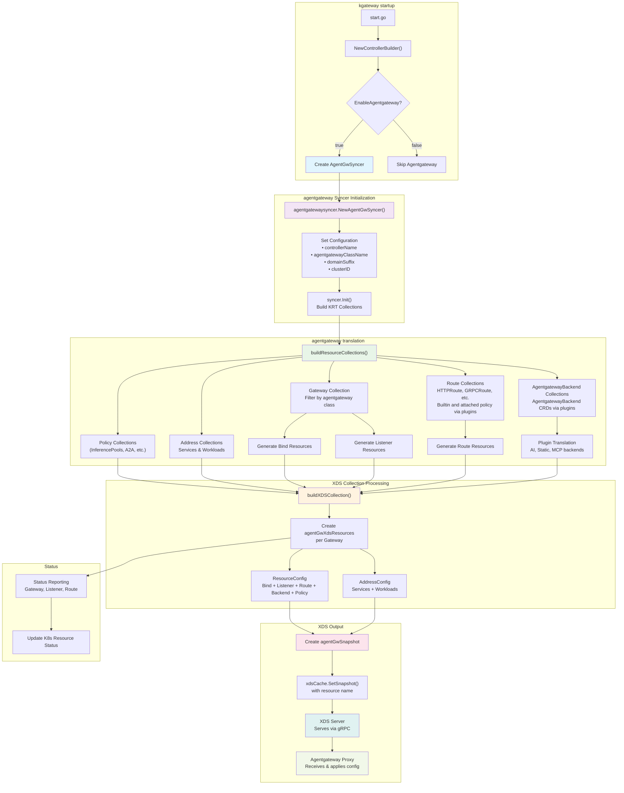

# agentgateway syncer

This syncer configures xds updates for the [agentgateway](https://agentgateway.dev/) data plane.

To use the agentgateway control plane with kgateway, the kgateway helm chart must be installed with `agentgateway.enabled` set to `true` (which is the default):
```yaml
agentgateway:
  enabled: true
```

You can configure the agentgateway Gateway class to use a specific image by setting the image field on the
AgentgatewayParameters:
```yaml
kind: AgentgatewayParameters
apiVersion: agentgateway.dev/v1alpha1
metadata:
  name: agentgateway-params
  namespace: default
spec:
  logging:
    format: text
  image:
    tag: bc92714
---
kind: GatewayClass
apiVersion: gateway.networking.k8s.io/v1
metadata:
  name: agentgateway
spec:
  controllerName: kgateway.dev/agentgateway
  parametersRef:
    group: agentgateway.dev
    kind: AgentgatewayParameters
    name: agentgateway-params
    namespace: default
---
kind: Gateway
apiVersion: gateway.networking.k8s.io/v1
metadata:
  name: agent-gateway
spec:
  gatewayClassName: agentgateway
  listeners:
    - protocol: HTTP
      port: 8080
      name: http
      allowedRoutes:
        namespaces:
          from: All
```

### APIs

The syncer uses the following APIs:

- [workload](https://github.com/agentgateway/agentgateway/tree/main/go/api/workload.pb.go)
- [resource](https://github.com/agentgateway/agentgateway/tree/main/go/api/resource.pb.go)

The workload API is originally derived from from Istio's [ztunnel](https://github.com/istio/ztunnel), where each address represents a unique address. The address API joins two sub-resources (Workload and Service) to support querying by IP address.

Resources contain agentgateway-specific config (Binds, Listeners, Routes, Backend, Policy, etc.).

#### Bind:

Bind resources define port bindings that associate gateway listeners with specific network ports. Each Bind contains:
- **Key**: Unique identifier in the format `port/namespace/name` (e.g., `8080/default/my-gateway`)
- **Port**: The network port number that the gateway listens on

Binds are created automatically when Gateway resources are processed, with one Bind per unique port used across all listeners.

#### Listener:

Listener resources represent individual gateway listeners with their configuration. Each Listener contains:
- **Key**: Unique identifier for the listener
- **Name**: The section name from the Gateway listener specification
- **BindKey**: References the associated Bind resource (format: `port/namespace/name`)
- **GatewayName**: The gateway this listener belongs to (format: `namespace/name`)
- **Hostname**: The hostname this listener accepts traffic for
- **Protocol**: The protocol type (HTTP, HTTPS, TCP, TLS)
- **TLS**: TLS configuration including certificates and termination mode

Listeners are created from Gateway API listener specifications and define how traffic is accepted and processed at the network level.

#### Routes:

Route resources define routing rules that determine how traffic is forwarded to backend services. Routes are created from various Gateway API route types:

- **HTTP Routes**: Convert from `HTTPRoute` resources with path, header, method, and query parameter matching
- **gRPC Routes**: Convert from `GRPCRoute` resources with service/method matching
- **TCP Routes**: Convert from `TCPRoute` resources for TCP traffic (catch-all matching)
- **TLS Routes**: Convert from `TLSRoute` resources for TLS passthrough (SNI matching at listener level)

Each Route contains:
- **Key**: Unique identifier (format: `namespace.name.rule.match`)
- **RouteName**: Source route name (format: `namespace/name`)
- **ListenerKey**: Associated listener (populated during gateway binding)
- **RuleName**: Optional rule name from the source route
- **Matches**: Traffic matching criteria (path, headers, method, query params)
- **Filters**: Request/response transformation filters
- **Backends**: Target backend services with load balancing and health checking
- **Hostnames**: Hostnames this route serves traffic for

Routes support various filters including header modification, redirects, URL rewrites, request mirroring, and policy attachments.

#### Backends:

Backend resources define target services and systems that traffic should be routed to. Unlike other resources, backends are global resources (not per-gateway) and are applied to all gateways in the agentgateway syncer.

Each backend has a unique name in the format `namespace/name`. Backends are processed through the plugin system that translates Kubernetes AgentgatewayBackend CRDs to agentgateway API resources

Backends for agentgateway are represented by the `AgentgatewayBackend` CRD and support the following backend types:

**Backend Types (agentgateway):**
- **AI**: Routes traffic to AI/LLM providers (OpenAI, Anthropic, Azure OpenAI, Bedrock, etc.)
- **MCP**: Model Context Protocol backends for virtual MCP servers. Static MCP targets are supported via `spec.mcp.targets[].static`.

**Usage in Routes:**
Backends are referenced by HTTPRoute, GRPCRoute, TCPRoute, and TLSRoute resources using `backendRefs`:

```yaml
apiVersion: gateway.networking.k8s.io/v1
kind: HTTPRoute
spec:
  rules:
    - backendRefs:
        - group: agentgateway.dev
          kind: AgentgatewayBackend
          name: my-backend
```

**Translation Process:**
1. AgentgatewayBackend CRDs are watched by the agentgateway syncer
2. Each backend is processed through registered plugins based on its type
3. Plugins translate the backend configuration to agentgateway API format
4. The resulting backend resources and associated policies are distributed to **all** gateways via xDS

#### Policies:

Policies for agentgateway are configured via the `AgentgatewayPolicy` CRD (attached to `Gateway`/`HTTPRoute`/`TCPRoute`). They configure the following agentgateway Policies:

Policies are configurable rules that control traffic behavior, security, and transformations for routes and backends.
- Request Header Modifier: Add, set, or remove HTTP request headers.
- Response Header Modifier: Add, set, or remove HTTP response headers.
- Request Redirect: Redirect incoming requests to a different scheme, authority, path, or status code.
- URL Rewrite: Rewrite the authority or path of requests before forwarding.
- Request Mirror: Mirror a percentage of requests to an additional backend for testing or analysis.
- CORS: Configure Cross-Origin Resource Sharing (CORS) settings for allowed origins, headers, methods, and credentials.
- A2A: Enable agent-to-agent (A2A) communication features.
- Backend Auth: Set up authentication for backend services (e.g., passthrough, key, GCP, AWS).
- Timeout: Set request and backend timeouts.
- Retry: Configure retry attempts, backoff, and which response codes should trigger retries.
- Transformations: Add, set or remove HTTP request and response headers and apply body transformations

### CEL Transformations

The agentgateway data plane supports [CEL](https://cel.dev/) (Common Expression Language) transformations through AgentgatewayPolicy resources. CEL transformations allow you to modify requests and responses using powerful expression language.

Unlike the Envoy data plane transformations that support Inja, the agentgateway transformations use CEL expressions.

#### Supported Transformation Types

**Header Transformations:**
- `set`: Replace or create headers with new values
- `add`: Add headers (append if header already exists)
- `remove`: Remove headers by name

**Body Transformations:**
- Modify request/response body content
- Parse JSON using `json()` function
- Transform strings and objects

#### Example

Apply this config to setup basic response and request header transformations for agentgateway data plane.

```shell
kubectl apply -f- <<EOF
kind: Gateway
apiVersion: gateway.networking.k8s.io/v1
metadata:
  name: example-gateway
spec:
  gatewayClassName: agentgateway
  listeners:
    - protocol: HTTP
      port: 8080
      name: http
      allowedRoutes:
        namespaces:
          from: Same
---
apiVersion: v1
kind: Service
metadata:
  name: simple-svc
  labels:
    app: simple-svc
spec:
  ports:
    - name: http
      port: 8080
      targetPort: 3000
  selector:
    app.kubernetes.io/name: backend-0
---
apiVersion: apps/v1
kind: Deployment
metadata:
  name: backend-0
spec:
  replicas: 1
  selector:
    matchLabels:
      app.kubernetes.io/name: backend-0
      version: v1
  template:
    metadata:
      labels:
        app.kubernetes.io/name: backend-0
        version: v1
    spec:
      containers:
        - image: gcr.io/k8s-staging-gateway-api/echo-basic:v20231214-v1.0.0-140-gf544a46e
          imagePullPolicy: IfNotPresent
          name: backend-0
          ports:
            - containerPort: 3000
          env:
            - name: POD_NAME
              valueFrom:
                fieldRef:
                  fieldPath: metadata.name
            - name: NAMESPACE
              valueFrom:
                fieldRef:
                  fieldPath: metadata.namespace
            - name: SERVICE_NAME
              value: simple-svc
---
apiVersion: gateway.networking.k8s.io/v1
kind: HTTPRoute
metadata:
  name: example-route
spec:
  parentRefs:
    - name: example-gateway
  hostnames:
    - "example-gateway-attached-transform.com"
  rules:
    - backendRefs:
        - name: simple-svc
          port: 8080
---
apiVersion: agentgateway.dev/v1alpha1
kind: AgentgatewayPolicy
metadata:
  name: example-agentgateway-policy-for-gateway-attached-transform
spec:
  targetRefs:
  - group: gateway.networking.k8s.io
    kind: Gateway
    name: example-gateway
  traffic:
    transformation:
      request:
        set:
          - name: request-gateway
            value: "'hello'"
      response:
        set:
          - name: response-gateway
            value: "'goodbye'"
EOF
```

#### Important Notes

- **parseAs field**: The `parseAs` field is not supported for agentgateway. Use `json()` function directly in CEL expressions instead
- **Data plane validation**: Invalid CEL expressions are handled by the agentgateway data plane

### Architecture

The agentgateway syncer only runs if `cfg.SetupOpts.GlobalSettings.EnableAgentgateway` is set. Otherwise,
only the Envoy proxy syncer will run by default.



### Translator tests

The translator tests are unit tests that test the translation of the CRD input YAML resources to the agentgateway xDS API.

You can regenerate the golden output files by running the following command:

```shell
REFRESH_GOLDEN="true" go test -shuffle on -run "TestBasic" ./pkg/kgateway/agentgatewaysyncer/...
```

### Conformance tests

Setup the cluster:

```shell
./hack/kind/setup-kind.sh
```

Retag and load the image to match the default image tag in the values file for agentgateway, then run:

```
make run HELM_ADDITIONAL_VALUES=test/e2e/tests/manifests/agent-gateway-integration.yaml; CONFORMANCE_GATEWAY_CLASS=agentgateway make conformance
```

Set up a kind cluster and install kgateway with the kubernetes Gateway APIs:
```shell
kubectl apply -f https://github.com/kubernetes-sigs/gateway-api/releases/download/v1.3.0/standard-install.yaml
helm upgrade -i --create-namespace --namespace kgateway-system --version v2.2.0-main kgateway-crds oci://cr.kgateway.dev/kgateway-dev/charts/kgateway-crds
helm upgrade -i --namespace kgateway-system --version v2.2.0-main kgateway oci://cr.kgateway.dev/kgateway-dev/charts/kgateway --set agentgateway.enabled=true --set inferenceExtension.enabled=true
```

#### HTTPRoute

Apply the httpbin test app:
```shell
kubectl apply -f  test/e2e/defaults/testdata/httpbin.yaml
```

Apply the following config to set up the HTTPRoute attached to the agentgateway Gateway:

```shell
kubectl apply -f- <<EOF
kind: Gateway
apiVersion: gateway.networking.k8s.io/v1
metadata:
  name: agent-gateway
spec:
  gatewayClassName: agentgateway
  listeners:
    - protocol: HTTP
      port: 8080
      name: http
      allowedRoutes:
        namespaces:
          from: All
---
apiVersion: gateway.networking.k8s.io/v1
kind: HTTPRoute
metadata:
  name: httpbin
  labels:
    example: httpbin-route
spec:
  parentRefs:
    - name: agent-gateway
      namespace: default
  hostnames:
    - "www.example.com"
  rules:
    - backendRefs:
        - name: httpbin
          port: 8000
EOF
```

Port-forward and send a request through the gateway:
```shell
 curl localhost:8080 -v -H "host: www.example.com"
```

#### GRPC Route

Apply the following config to set up the GRPCRoute attached to the agentgateway Gateway:
```shell
kubectl apply -f- <<EOF
kind: Gateway
apiVersion: gateway.networking.k8s.io/v1
metadata:
  name: agent-gateway
spec:
  gatewayClassName: agentgateway
  listeners:
    - protocol: HTTP
      port: 8080
      name: http
      allowedRoutes:
        namespaces:
          from: All
---
apiVersion: gateway.networking.k8s.io/v1
kind: GRPCRoute
metadata:
  name: grpc-route
spec:
  parentRefs:
    - name: agent-gateway
  hostnames:
    - "example.com"
  rules:
    - matches:
        - method:
            method: ServerReflectionInfo
            service: grpc.reflection.v1alpha.ServerReflection
        - method:
            method: Ping
      backendRefs:
        - name: grpc-echo-svc
          port: 3000
---
apiVersion: apps/v1
kind: Deployment
metadata:
  name: grpc-echo
spec:
  selector:
    matchLabels:
      app: grpc-echo
  replicas: 1
  template:
    metadata:
      labels:
        app: grpc-echo
    spec:
      containers:
        - name: grpc-echo
          image: ghcr.io/projectcontour/yages:v0.1.0
          ports:
            - containerPort: 9000
              protocol: TCP
          env:
            - name: POD_NAME
              valueFrom:
                fieldRef:
                  fieldPath: metadata.name
            - name: NAMESPACE
              valueFrom:
                fieldRef:
                  fieldPath: metadata.namespace
            - name: GRPC_ECHO_SERVER
              value: "true"
            - name: SERVICE_NAME
              value: grpc-echo
---
apiVersion: v1
kind: Service
metadata:
  name: grpc-echo-svc
spec:
  type: ClusterIP
  ports:
    - port: 3000
      protocol: TCP
      targetPort: 9000
      appProtocol: kubernetes.io/h2c
  selector:
    app: grpc-echo
---
apiVersion: v1
kind: Pod
metadata:
  name: grpcurl-client
spec:
  containers:
    - name: grpcurl
      image: docker.io/fullstorydev/grpcurl:v1.8.7-alpine
      command:
        - sleep
        - "infinity"
EOF
```

Port-forward, and send a request through the gateway:
```shell
grpcurl \
  -plaintext \
  -authority example.com \
  -d '{}' localhost:8080 yages.Echo/Ping
```

#### TCPRoute

Apply the following config to set up the TCPRoute attached to the agentgateway Gateway:
```shell
kubectl apply -f- <<EOF
kind: Gateway
apiVersion: gateway.networking.k8s.io/v1
metadata:
  name: tcp-gw-for-test
spec:
  gatewayClassName: agentgateway
  listeners:
    - name: tcp
      protocol: TCP
      port: 8080
      allowedRoutes:
        kinds:
          - kind: TCPRoute
---
apiVersion: gateway.networking.k8s.io/v1alpha2
kind: TCPRoute
metadata:
  name: tcp-app-1
spec:
  parentRefs:
    - name: tcp-gw-for-test
  rules:
    - name: test
      backendRefs:
        - name: tcp-backend
          port: 3001
---
apiVersion: apps/v1
kind: Deployment
metadata:
  name: tcp-backend
spec:
  replicas: 1
  selector:
    matchLabels:
      app: tcp-backend
      version: v1
  template:
    metadata:
      labels:
        app: tcp-backend
        version: v1
    spec:
      containers:
        - image: gcr.io/k8s-staging-gateway-api/echo-basic:v20231214-v1.0.0-140-gf544a46e
          imagePullPolicy: IfNotPresent
          name: tcp-backend
          ports:
            - containerPort: 3000
          env:
            - name: POD_NAME
              valueFrom:
                fieldRef:
                  fieldPath: metadata.name
            - name: NAMESPACE
              valueFrom:
                fieldRef:
                  fieldPath: metadata.namespace
            - name: SERVICE_NAME
              value: tcp-backend
---
apiVersion: v1
kind: Service
metadata:
  name: tcp-backend
  labels:
    app: tcp-backend
spec:
  ports:
    - name: http
      port: 3001
      targetPort: 3000
  selector:
    app: tcp-backend
EOF
```

Port-forward, and send a request through the gateway:
```shell
curl localhost:8080/ -i
```

#### Static Backend routing

Apply the following config to set up the HTTPRoute pointing to the static backend:

```shell
kubectl apply -f- <<EOF
kind: Gateway
apiVersion: gateway.networking.k8s.io/v1
metadata:
  name: gw
spec:
  gatewayClassName: agentgateway
  listeners:
    - protocol: HTTP
      port: 8080
      name: http
      allowedRoutes:
        namespaces:
          from: All
---
apiVersion: gateway.networking.k8s.io/v1
kind: HTTPRoute
metadata:
  name: json-route
spec:
  parentRefs:
    - name: gw
  hostnames:
    - "jsonplaceholder.typicode.com"
  rules:
    - backendRefs:
        - name: json-backend
          kind: AgentgatewayBackend
          group: agentgateway.dev
---
apiVersion: agentgateway.dev/v1alpha1
kind: AgentgatewayBackend
metadata:
  name: json-backend
spec:
  static:
    host: jsonplaceholder.typicode.com
    port: 80
EOF
```

Port-forward, and send a request through the gateway:
```shell
curl localhost:8080/ -v -H "host: jsonplaceholder.typicode.com"
```

#### AI Backend routing

First, create secret in the cluster with the API key:
```shell
kubectl create secret generic openai-secret \
--from-literal="Authorization=Bearer $OPENAI_API_KEY" \
--dry-run=client -oyaml | kubectl apply -f -
```

Apply the following config to set up the HTTPRoute pointing to the AI Backend:

```shell
kubectl apply -f- <<EOF
kind: Gateway
apiVersion: gateway.networking.k8s.io/v1
metadata:
  name: agent-gateway
spec:
  gatewayClassName: agentgateway
  listeners:
    - protocol: HTTP
      port: 8080
      name: http
      allowedRoutes:
        namespaces:
          from: All
---
apiVersion: gateway.networking.k8s.io/v1
kind: HTTPRoute
metadata:
  name: openai
  labels:
    example: openai-route
spec:
  parentRefs:
    - name: agent-gateway
      namespace: default
  rules:
    - matches:
        - path:
            type: PathPrefix
            value: /openai
      backendRefs:
        - name: openai
          group: agentgateway.dev
          kind: AgentgatewayBackend
---
apiVersion: agentgateway.dev/v1alpha1
kind: AgentgatewayBackend
metadata:
  name: openai
spec:
  ai:
    provider:
      openai:
        model: "gpt-4o-mini"
  policies:
    auth:
      secretRef:
        name: openai-secret
EOF
```

Port-forward, and send a request through the gateway:
```shell
curl localhost:8080/openai -H content-type:application/json -v -d'{
"model": "gpt-3.5-turbo",
"messages": [
  {
    "role": "user",
    "content": "Whats your favorite poem?"
  }
]}'
```

With agentgateway, you get a unified API to send requests to different providers in the same format.

Modify the HTTPRoute config to add another provider:

```shell
kubectl apply -f- <<EOF
apiVersion: gateway.networking.k8s.io/v1
kind: HTTPRoute
metadata:
  name: openai
  labels:
    example: openai-route
spec:
  parentRefs:
    - name: agent-gateway
      namespace: default
  rules:
    - matches:
        - path:
            type: PathPrefix
            value: /openai
      backendRefs:
        - name: openai
          group: agentgateway.dev
          kind: AgentgatewayBackend
    - matches:
        - path:
            type: PathPrefix
            value: /bedrock
      backendRefs:
        - group: agentgateway.dev
          kind: AgentgatewayBackend
          name: bedrock
---
apiVersion: agentgateway.dev/v1alpha1
kind: AgentgatewayBackend
metadata:
  name: bedrock
spec:
  ai:
    provider:
      bedrock:
        model: anthropic.claude-3-5-haiku-20241022-v1:0
        region: us-west-2
  policies:
    auth:
      secretRef:
        name: bedrock-secret
---
apiVersion: v1
kind: Secret
metadata:
  name: bedrock-secret
stringData:
  accessKey: ${AWS_ACCESS_KEY_ID}
  secretKey: ${AWS_SECRET_ACCESS_KEY}
  sessionToken: ${AWS_SESSION_TOKEN}
type: Opaque
EOF
```
The request you send can be formatted in the same Open AI format:

```shell
curl localhost:8080/ -H content-type:application/json -v -d'{
"model": "anthropic.claude-3-5-haiku-20241022-v1:0",
"messages": [
  {
    "role": "user",
    "content": "Whats your favorite poem?"
  }
]}'
```

You can send streaming requests using the Open AI format as well:
```shell
curl localhost:8080/ -H content-type:application/json -v -d'{
"model": "anthropic.claude-3-5-haiku-20241022-v1:0",
"stream": true,
"messages": [
  {
    "role": "user",
    "content": "Whats your favorite poem?"
  }
]}'
```

#### MCP Backend

Apply the following config to set up the HTTPRoute pointing to the MCP Backend:
```shell
kubectl apply -f- <<EOF
kind: Gateway
apiVersion: gateway.networking.k8s.io/v1
metadata:
  name: agent-gateway
spec:
  gatewayClassName: agentgateway
  listeners:
    - protocol: HTTP
      port: 8080
      name: http
      allowedRoutes:
        namespaces:
          from: All
---
apiVersion: gateway.networking.k8s.io/v1
kind: HTTPRoute
metadata:
  name: mcp
  labels:
    example: mcp-route
spec:
  parentRefs:
    - name: agent-gateway
      namespace: default
  rules:
    - backendRefs:
        - name: mcp-backend
          group: agentgateway.dev
          kind: AgentgatewayBackend
---
apiVersion: agentgateway.dev/v1alpha1
kind: AgentgatewayBackend
metadata:
  labels:
    app: kgateway
  name: mcp-backend
spec:
  mcp:
    targets:
      - name: mcp-server
        selector:
          services:
            matchLabels:
              app: mcp-server
---
apiVersion: apps/v1
kind: Deployment
metadata:
  name: mcp-server
  labels:
    app: mcp-server
spec:
  replicas: 1
  selector:
    matchLabels:
      app: mcp-server
  template:
    metadata:
      labels:
        app: mcp-server
    spec:
      containers:
        - name: mcp-server
          image: node:20-alpine
          command: ["npx"]
          args: ["-y", "@modelcontextprotocol/server-everything", "streamableHttp"]
          ports:
            - containerPort: 3001
---
apiVersion: v1
kind: Service
metadata:
  name: mcp-server
  labels:
    app: mcp-server
spec:
  selector:
    app: mcp-server
  ports:
    - protocol: TCP
      port: 3001
      targetPort: 3001
      appProtocol: kgateway.dev/mcp
  type: ClusterIP
EOF
```

Note: Only streamable HTTP is currently supported for label selectors.

Port-forward, and send a request through the gateway to start a session:
```shell
curl localhost:8080/sse -v
```

You should see a response with the session id:
```shell
event: endpoint
data: ?sessionId=c1a54dcb-be11-4f91-91b5-a1abf67deca2

```

Then you can send a request using the sessionId to initialize the connection:
```shell
curl "http://localhost:8080/mcp" -v \
  -H "Accept: text/event-stream,application/json" \
  --json '{"method":"initialize","params":{"protocolVersion":"2025-06-18","capabilities":{"roots":{}},"clientInfo":{"name":"claude-code","version":"1.0.60"}},"jsonrpc":"2.0","id":0}'
```

Or inspect the mcp tool with [MCP Inspector](https://github.com/modelcontextprotocol/inspector):
```shell
npx @modelcontextprotocol/inspector
```

You can also use static targets. This will create two backends 1) static backend for the target, 2) mcp backend.

Apply the following config to set up the HTTPRoute pointing to the MCP Backend with a static target:
```shell
kubectl apply -f- <<EOF
apiVersion: gateway.networking.k8s.io/v1
kind: HTTPRoute
metadata:
  name: mcp
spec:
  parentRefs:
  - name: agent-gateway
  rules:
    - backendRefs:
      - name: mcp-backend
        group: agentgateway.dev
        kind: AgentgatewayBackend
---
apiVersion: agentgateway.dev/v1alpha1
kind: AgentgatewayBackend
metadata:
  name: mcp-backend
spec:
  mcp:
    targets:
    - name: mcp-target
      static:
        host: mcp-website-fetcher.default.svc.cluster.local
        port: 80
        protocol: SSE
---
apiVersion: apps/v1
kind: Deployment
metadata:
  name: mcp-website-fetcher
spec:
  selector:
    matchLabels:
      app: mcp-website-fetcher
  template:
    metadata:
      labels:
        app: mcp-website-fetcher
    spec:
      containers:
      - name: mcp-website-fetcher
        image: ghcr.io/peterj/mcp-website-fetcher:main
        imagePullPolicy: Always
---
apiVersion: v1
kind: Service
metadata:
  name: mcp-website-fetcher
  labels:
    app: mcp-website-fetcher
spec:
  selector:
    app: mcp-website-fetcher
  ports:
  - port: 80
    targetPort: 8000
    appProtocol: kgateway.dev/mcp
EOF
```

#### A2A Backend

Apply the sample app:
```shell
kubectl apply -f- <<EOF
apiVersion: apps/v1
kind: Deployment
metadata:
  name: a2a-agent
  labels:
    app: a2a-agent
spec:
  selector:
    matchLabels:
      app: a2a-agent
  template:
    metadata:
      labels:
        app: a2a-agent
    spec:
      containers:
        - name: a2a-agent
          image: ghcr.io/kgateway-dev/test-a2a-server:0.0.3
          ports:
            - containerPort: 9090
---
apiVersion: v1
kind: Service
metadata:
  name: a2a-agent
spec:
  selector:
    app: a2a-agent
  type: ClusterIP
  ports:
    - protocol: TCP
      port: 9090
      targetPort: 9090
      appProtocol: kgateway.dev/a2a
EOF
```

Note, you must use `kgateway.dev/a2a` as the app protocol for the kgateway control plane to configure agentgateway to use a2a.

Apply the routing config:
```shell
kubectl apply -f- <<EOF
kind: Gateway
apiVersion: gateway.networking.k8s.io/v1
metadata:
  name: agent-gateway
spec:
  gatewayClassName: agentgateway
  listeners:
    - protocol: HTTP
      port: 8080
      name: http
      allowedRoutes:
        namespaces:
          from: All
---
apiVersion: gateway.networking.k8s.io/v1
kind: HTTPRoute
metadata:
  name: a2a
  labels:
    example: a2a-route
spec:
  parentRefs:
    - name: agent-gateway
      namespace: default
  rules:
    - backendRefs:
        - name: a2a-agent
          port: 9090
EOF
```

Port-forward, and send a request through the gateway:
```shell
 curl -X POST http://localhost:8080/ \
-H "Content-Type: application/json" \
  -v \
  -d '{
"jsonrpc": "2.0",
"id": "1",
"method": "tasks/send",
"params": {
  "id": "1",
  "message": {
    "role": "user",
    "parts": [
      {
        "type": "text",
        "text": "hello gateway!"
      }
    ]
  }
}
}'
```

### Tracing and Observability

The agentgateway data plane supports comprehensive observability through OpenTelemetry (OTEL) tracing. You can configure tracing using the `rawConfig` field in AgentgatewayParameters to integrate with various observability platforms and add custom trace fields for enhanced monitoring of your AI/LLM traffic.

For detailed information about tracing configuration and observability features, see the [agentgateway observability documentation](https://agentgateway.dev/docs/reference/observability/traces/).

#### Configuring Tracing with RawConfig

To enable tracing, configure the `rawConfig` field in AgentgatewayParameters with your tracing settings. Changes to `rawConfig` will automatically trigger an agentgateway pod rollout.

```yaml
apiVersion: agentgateway.dev/v1alpha1
kind: AgentgatewayParameters
metadata:
  name: agentgateway-params
  namespace: default
spec:
  logging:
    format: json
  rawConfig:
    config:
      tracing:
        otlpEndpoint: http://jaeger-collector.observability.svc.cluster.local:4317
        otlpProtocol: grpc
        randomSampling: true
        fields:
          add:
            gen_ai.operation.name: '"chat"'
            gen_ai.system: "llm.provider"
            gen_ai.request.model: "llm.request_model"
            gen_ai.response.model: "llm.response_model"
            gen_ai.usage.completion_tokens: "llm.output_tokens"
            gen_ai.usage.prompt_tokens: "llm.input_tokens"
---
apiVersion: gateway.networking.k8s.io/v1
kind: GatewayClass
metadata:
  name: agentgateway
spec:
  controllerName: kgateway.dev/agentgateway
  parametersRef:
    group: agentgateway.dev
    kind: AgentgatewayParameters
    name: agentgateway-params
    namespace: default
---
apiVersion: gateway.networking.k8s.io/v1
kind: Gateway
metadata:
  name: agent-gateway
spec:
  gatewayClassName: agentgateway
  listeners:
    - protocol: HTTP
      port: 8080
      name: http
```

#### Tracing Configuration Options

**Basic OTEL Configuration:**
```yaml
config:
  tracing:
    otlpEndpoint: http://localhost:4317      # OTEL collector endpoint
    otlpProtocol: grpc                       # grpc or http
    randomSampling: true                     # Enable/disable sampling
    headers:                                 # Optional headers for authentication
      Authorization: "Bearer <token>"
```

**Custom Trace Fields:**
Use CEL expressions to add custom fields to your traces:

```yaml
config:
  tracing:
    fields:
      add:
        # Standard OpenTelemetry AI semantic conventions
        gen_ai.operation.name: '"chat"'
        gen_ai.system: "llm.provider"
        gen_ai.request.model: "llm.request_model"
        gen_ai.response.model: "llm.response_model"
        gen_ai.usage.completion_tokens: "llm.output_tokens"
        gen_ai.usage.prompt_tokens: "llm.input_tokens"

        # Custom business logic fields
        user.id: "request.headers['x-user-id']"
        request.path: "request.path"
        backend.type: "llm.provider"
```

#### Integration Examples

These examples show the `rawConfig` configuration for different observability platforms.

**Jaeger Integration:**
```yaml
rawConfig:
  config:
    tracing:
      otlpEndpoint: http://jaeger-collector.jaeger.svc.cluster.local:4317
      otlpProtocol: grpc
      randomSampling: true
      fields:
        add:
          gen_ai.operation.name: '"chat"'
          gen_ai.system: "llm.provider"
          gen_ai.request.model: "llm.request_model"
          gen_ai.response.model: "llm.response_model"
          gen_ai.usage.completion_tokens: "llm.output_tokens"
          gen_ai.usage.prompt_tokens: "llm.input_tokens"
```

**Langfuse Integration:**
```yaml
rawConfig:
  config:
    tracing:
      otlpEndpoint: https://us.cloud.langfuse.com/api/public/otel
      otlpProtocol: http
      headers:
        Authorization: "Basic <base64-encoded-credentials>"
      randomSampling: true
      fields:
        add:
          gen_ai.operation.name: '"chat"'
          gen_ai.system: "llm.provider"
          gen_ai.prompt: "llm.prompt"
          gen_ai.completion: 'llm.completion.map(c, {"role":"assistant", "content": c})'
          gen_ai.usage.completion_tokens: "llm.output_tokens"
          gen_ai.usage.prompt_tokens: "llm.input_tokens"
          gen_ai.request.model: "llm.request_model"
          gen_ai.response.model: "llm.response_model"
          gen_ai.request: "flatten(llm.params)"
```

**Phoenix (Arize) Integration:**
```yaml
rawConfig:
  config:
    tracing:
      otlpEndpoint: http://localhost:4317
      randomSampling: true
      fields:
        add:
          span.name: '"openai.chat"'
          openinference.span.kind: '"LLM"'
          llm.system: "llm.provider"
          llm.input_messages: 'flatten_recursive(llm.prompt.map(c, {"message": c}))'
          llm.output_messages: 'flatten_recursive(llm.completion.map(c, {"role":"assistant", "content": c}))'
          llm.token_count.completion: "llm.output_tokens"
          llm.token_count.prompt: "llm.input_tokens"
          llm.token_count.total: "llm.total_tokens"
```

**OpenLLMetry Integration:**
```yaml
rawConfig:
  config:
    tracing:
      otlpEndpoint: http://localhost:4317
      randomSampling: true
      fields:
        add:
          span.name: '"openai.chat"'
          gen_ai.operation.name: '"chat"'
          gen_ai.system: "llm.provider"
          gen_ai.prompt: "flatten_recursive(llm.prompt)"
          gen_ai.completion: 'flatten_recursive(llm.completion.map(c, {"role":"assistant", "content": c}))'
          gen_ai.usage.completion_tokens: "llm.output_tokens"
          gen_ai.usage.prompt_tokens: "llm.input_tokens"
          gen_ai.request.model: "llm.request_model"
          gen_ai.response.model: "llm.response_model"
          gen_ai.request: "flatten(llm.params)"
          llm.is_streaming: "llm.streaming"
```

#### Important Notes

- **RawConfig Updates**: Changes to `rawConfig` in AgentgatewayParameters will trigger an agentgateway pod rollout automatically
- **Validation**: Invalid CEL expressions in trace fields will be logged but won't prevent the gateway from starting
- **Performance**: Be mindful of the number and complexity of custom trace fields, as they impact performance
- **Sampling**: Use `randomSampling` to control trace volume in production environments

#### Complete Example with AI Backend

```shell
kubectl apply -f- <<'EOF'
# AgentgatewayParameters with inline tracing configuration via rawConfig
apiVersion: agentgateway.dev/v1alpha1
kind: AgentgatewayParameters
metadata:
  name: agentgateway-params
  namespace: default
spec:
  logging:
    format: text
  rawConfig:
    config:
      tracing:
        otlpEndpoint: http://jaeger-collector.observability.svc.cluster.local:4317
        otlpProtocol: grpc
        randomSampling: true
        fields:
          add:
            gen_ai.operation.name: '"chat"'
            gen_ai.system: "llm.provider"
            gen_ai.request.model: "llm.request_model"
            gen_ai.response.model: "llm.response_model"
            gen_ai.usage.completion_tokens: "llm.output_tokens"
            gen_ai.usage.prompt_tokens: "llm.input_tokens"
            user.id: "request.headers['x-user-id'] || 'anonymous'"
            request.path: "request.path"
---
# GatewayClass and Gateway configuration
apiVersion: gateway.networking.k8s.io/v1
kind: GatewayClass
metadata:
  name: agentgateway
spec:
  controllerName: kgateway.dev/agentgateway
  parametersRef:
    group: agentgateway.dev
    kind: AgentgatewayParameters
    name: agentgateway-params
    namespace: default
---
apiVersion: gateway.networking.k8s.io/v1
kind: Gateway
metadata:
  name: ai-gateway
spec:
  gatewayClassName: agentgateway
  listeners:
    - protocol: HTTP
      port: 8080
      name: http
---
# AI Backend and Route
apiVersion: agentgateway.dev/v1alpha1
kind: AgentgatewayBackend
metadata:
  name: openai-backend
spec:
  ai:
    provider:
      openai:
        model: "gpt-4o-mini"
  policies:
    auth:
      secretRef:
        name: openai-secret
---
apiVersion: gateway.networking.k8s.io/v1
kind: HTTPRoute
metadata:
  name: ai-route
spec:
  parentRefs:
    - name: ai-gateway
  rules:
    - backendRefs:
        - name: openai-backend
          group: agentgateway.dev
          kind: AgentgatewayBackend
EOF
```

#### Example with MCP Tool Calling and Trace Verification

Here's a complete example that demonstrates tracing MCP tool calls, which generates rich trace spans for `list_tools` and `call_tool` operations:

```shell
kubectl apply -f- <<'EOF'
# AgentgatewayParameters with inline tracing configuration via rawConfig
apiVersion: agentgateway.dev/v1alpha1
kind: AgentgatewayParameters
metadata:
  name: agentgateway-params
  namespace: default
spec:
  logging:
    format: text
  rawConfig:
    config:
      tracing:
        otlpEndpoint: http://localhost:4317
        randomSampling: true
        fields:
          add:
            # MCP-specific trace fields
            mcp.operation.name: "request.path"
            mcp.tool.name: "request.headers['x-tool-name'] || 'unknown'"
            mcp.session.id: "request.headers['x-session-id'] || 'anonymous'"
            backend.type: '"mcp"'
            request.method: "request.method"
            response.status: "response.status_code"
---
# Gateway Class
apiVersion: gateway.networking.k8s.io/v1
kind: GatewayClass
metadata:
  name: agentgateway
spec:
  controllerName: kgateway.dev/agentgateway
  parametersRef:
    group: agentgateway.dev
    kind: AgentgatewayParameters
    name: agentgateway-params
    namespace: default
---
# Gateway
apiVersion: gateway.networking.k8s.io/v1
kind: Gateway
metadata:
  name: agentgateway
  namespace: default
spec:
  gatewayClassName: agentgateway
  listeners:
    - protocol: HTTP
      port: 3000
      name: http
      allowedRoutes:
        namespaces:
          from: All
---
# MCP Backend
apiVersion: agentgateway.dev/v1alpha1
kind: AgentgatewayBackend
metadata:
  name: mcp-everything-backend
  namespace: default
spec:
  mcp:
    targets:
      - name: everything
        selector:
          services:
            matchLabels:
              app: mcp-everything
---
# HTTPRoute with CORS policy and MCP backend
apiVersion: gateway.networking.k8s.io/v1
kind: HTTPRoute
metadata:
  name: mcp-route
  namespace: default
spec:
  parentRefs:
    - name: agentgateway
  rules:
    - matches:
        - path:
            type: PathPrefix
            value: "/"
      filters:
        # CORS policy
        - type: CORS
          cors:
            allowOrigins:
            - "http://localhost:3000"
            - "http://localhost:8080"
            - "http://localhost:15000"
            - "http://127.0.0.1:3000"
            - "http://127.0.0.1:8080"
            - "http://127.0.0.1:15000"
            allowMethods:
            - "GET"
            - "POST"
            - "PUT"
            - "DELETE"
            - "OPTIONS"
            allowHeaders:
            - "Content-Type"
            - "Authorization"
            - "Accept"
            - "mcp-protocol-version"
            - "Cache-Control"
            maxAge: 86400
      backendRefs:
        - name: mcp-everything-backend
          group: agentgateway.dev
          kind: AgentgatewayBackend
---
# MCP Everything Server Deployment
apiVersion: apps/v1
kind: Deployment
metadata:
  name: mcp-everything
  namespace: default
  labels:
    app: mcp-everything
spec:
  replicas: 1
  selector:
    matchLabels:
      app: mcp-everything
  template:
    metadata:
      labels:
        app: mcp-everything
    spec:
      containers:
        - name: mcp-everything
          image: node:20-alpine
          command: ["npx"]
          args: ["@modelcontextprotocol/server-everything", "streamableHttp"]
          ports:
            - containerPort: 3001
          env:
            - name: PORT
              value: "3001"
---
# Service for MCP Everything Server
apiVersion: v1
kind: Service
metadata:
  name: mcp-everything-service
  namespace: default
  labels:
    app: mcp-everything
spec:
  selector:
    app: mcp-everything
  ports:
    - protocol: TCP
      port: 3001
      targetPort: 3001
      appProtocol: kgateway.dev/mcp
  type: ClusterIP
EOF
```

**Testing MCP Tool Calls with Traces:**

1. **Set up port forwarding:**
```bash
# Port forward to the gateway pod
kubectl port-forward deployment/agentgateway 15000:15000 3000:3000
```

**Verify traces:**

1. **Open the agentgateway UI** to view your listener and target configuration.

2. **Connect to the MCP server** with the agentgateway UI playground.
   - From the navigation menu, click **Playground**.

3. **In the Testing card**, review your Connection details and click **Connect**. The agentgateway UI connects to the target that you configured and retrieves the tools that are exposed on the target.

4. **Verify that you see a list of Available Tools**.

5. **Verify access to a tool**:
   - From the Available Tools list, select the **echo** tool.
   - In the message field, enter any string, such as `hello world`, and click **Run Tool**.
   - Verify that you see your message echoed in the Response card.

6. **Open the Jaeger UI**.

7. **View traces**:
   - From the Service drop down, select **agentgateway**.
   - Click **Find Traces**.
   - Verify that you can see trace spans for listing the MCP tools (`list_tools`) and calling a tool (`call_tool`).

This configuration provides comprehensive tracing for your MCP tool interactions, making it easy to debug issues and monitor performance of your agent-to-agent communications.


### Additional AgentgatewayPolicy examples

#### JWTAuthentication
Use `AgentgatewayPolicy.spec.traffic.jwtAuthentication` to validate JWTs at the Gateway or Route. You can configure multiple providers and supply keys via remote JWKS (`jwks.remote.jwksUri`) or inline JWKS (`jwks.inline`). JWT auth can be combined with `authorization.policy.matchExpressions` for simple RBAC-style allow rules.

```shell
kubectl apply -f- <<EOF
apiVersion: gateway.networking.k8s.io/v1
kind: HTTPRoute
metadata:
  name: route-example-insecure
spec:
  parentRefs:
    - name: super-gateway
  hostnames:
    - "insecureroute.com"
  rules:
    - backendRefs:
        - name: backend-0
          port: 8080
EOF
```

##### Remote JWKS (Route-scoped)

```shell
kubectl apply -f- <<EOF
apiVersion: gateway.networking.k8s.io/v1
kind: HTTPRoute
metadata:
  name: route-secure
spec:
  parentRefs:
    - name: super-gateway
  hostnames:
    - "secureroute.com"
  rules:
    - backendRefs:
        - name: backend-0
          port: 8080
---
# jwks were generated using hack/utils/jwt/jwt-generator.go
apiVersion: agentgateway.dev/v1alpha1
kind: AgentgatewayPolicy
metadata:
  name: route-policy
spec:
  targetRefs:
  - group: gateway.networking.k8s.io
    kind: HTTPRoute
    name: route-secure
  traffic:
    jwtAuthentication:
      mode: Strict
      providers:
      - issuer: https://kgateway.dev
        jwks:
          remote:
            jwksUri: https://dummy-idp.default:8443/org-one/keys
      - issuer: https://kgateway.dev
        jwks:
          remote:
            jwksUri: https://dummy-idp.default:8443/org-two/keys
EOF
```

##### Inline JWKS (Route-scoped)

```shell
kubectl apply -f- <<'EOF'
apiVersion: gateway.networking.k8s.io/v1
kind: HTTPRoute
metadata:
  name: route-secure
spec:
  parentRefs:
    - name: super-gateway
  hostnames:
    - "secureroute.com"
  rules:
    - backendRefs:
        - name: backend-0
          port: 8080
---
# jwks were generated using hack/utils/jwt/jwt-generator.go
apiVersion: agentgateway.dev/v1alpha1
kind: AgentgatewayPolicy
metadata:
  name: route-policy
spec:
  targetRefs:
  - group: gateway.networking.k8s.io
    kind: HTTPRoute
    name: route-secure
  traffic:
    jwtAuthentication:
      mode: Strict
      providers:
      - issuer: https://kgateway.dev
        jwks:
          inline: '{"keys":[{"use":"sig","kty":"RSA","kid":"5333780687551038659","n":"1ovFhi3vyvF6DsbWanZrUUVgQVIUULNRczlyu1dJw8SoqSz5HRtfQUSVq_yuprKrpSz6oam8gAsXtpp570f8P3zm3kXBRzBq6-DAjx-4V5l0x7O89a35FkDjaiS4ci1r6_Z0nWjlIw-WY4w1kf1OwuDYjYJCgHgcRhMXblhVvcpq74de_0aezXNHVaA9sqqa78wciQc1ho2T2jkJ5-5OdfPw6YrkUwHrQIP37fH4wJCVmdyxPgwqNphQInmOrlbeisS2ih-s7ZJcC8eXaZrNZopHyrw2rhWM4eCwogFVuYpF6-coMXyEGk_SzYUaX5XMgZcZW1-SmTNtxtEKqFDSlw","e":"AQAB","x5c":["MIIC3jCCAcagAwIBAgIBQzANBgkqhkiG9w0BAQsFADAXMRUwEwYDVQQKEwxrZ2F0ZXdheS5kZXYwHhcNMjUxMTE0MTc1MjA4WhcNMjUxMTE0MTk1MjA4WjAXMRUwEwYDVQQKEwxrZ2F0ZXdheS5kZXYwggEiMA0GCSqGSIb3DQEBAQUAA4IBDwAwggEKAoIBAQDWi8WGLe/K8XoOxtZqdmtRRWBBUhRQs1FzOXK7V0nDxKipLPkdG19BRJWr/K6msqulLPqhqbyACxe2mnnvR/w/fObeRcFHMGrr4MCPH7hXmXTHs7z1rfkWQONqJLhyLWvr9nSdaOUjD5ZjjDWR/U7C4NiNgkKAeBxGExduWFW9ymrvh17/Rp7Nc0dVoD2yqprvzByJBzWGjZPaOQnn7k518/DpiuRTAetAg/ft8fjAkJWZ3LE+DCo2mFAieY6uVt6KxLaKH6ztklwLx5dpms1mikfKvDauFYzh4LCiAVW5ikXr5ygxfIQaT9LNhRpflcyBlxlbX5KZM23G0QqoUNKXAgMBAAGjNTAzMA4GA1UdDwEB/wQEAwIFoDATBgNVHSUEDDAKBggrBgEFBQcDATAMBgNVHRMBAf8EAjAAMA0GCSqGSIb3DQEBCwUAA4IBAQCC71YGcmJvrmjSOd33nPsRpTO+arEex2Se5f0nSrglTfubYl4Bb8L/MnF87yHkc+50/dvCbXB9lJwblfsO/HjWAwBnM94ePqIurLRn0tflsW+22PR/2lcnru74HDN+p8/9ZtedchYWetcD4k1boMhUOgolte1WrHNvAsm2divBsWrO6Fg3kKjgTItARFyrmhjFz+QYBuFKw6b16dB9n4kSbCiFVJ49GqU9T+7cs7cL8SCC69jMgcSK8ythN693rYDU5Cz/xTqNx+3Tk+yKFCg+vr4rIxV1ACrE61plnY8qGph64FEZpAPU6xL3K0V/Y+TXsfpjL9jhi+9bvOdNr3Vy"]}]}'
      - issuer: https://kgateway.dev
        jwks:
          inline: '{"keys":[{"use":"sig","kty":"RSA","kid":"7105793955086939664","n":"oQqLI89RuTy4d_DLuDBInE2w5bEpTBnoMpo0x6pWJWm48jP-tTF3r6156HmLPzUGHMpKolfZReVXj1eXXp5NUiOB3McvaemUPYZe8ZSQ9YrbTmodiVc6_S0ipT-SlO-nyjxZM2rvc2PUoYNipTOWyhq7YWYmaQ607g5zUItcn_omiFAgJFAXQJ5BSe4RUKbObKvLxHKDPfqNmG_K_DJy_0TmoBV9OGIwECCi7wtZ9icYJgfclH_v2nDaaxRvXA_9NPASPLJ8-B3a_soJqzX_tGi2QfLgtnoJKxUp-mprQzXMK0TBUm3ycCjch4FMykJCeGluV0H7F025u4wUkGu71w","e":"AQAB","x5c":["MIIC3jCCAcagAwIBAgIBETANBgkqhkiG9w0BAQsFADAXMRUwEwYDVQQKEwxrZ2F0ZXdheS5kZXYwHhcNMjUxMTE0MTc1NTU1WhcNMjUxMTE0MTk1NTU1WjAXMRUwEwYDVQQKEwxrZ2F0ZXdheS5kZXYwggEiMA0GCSqGSIb3DQEBAQUAA4IBDwAwggEKAoIBAQChCosjz1G5PLh38Mu4MEicTbDlsSlMGegymjTHqlYlabjyM/61MXevrXnoeYs/NQYcykqiV9lF5VePV5denk1SI4Hcxy9p6ZQ9hl7xlJD1ittOah2JVzr9LSKlP5KU76fKPFkzau9zY9Shg2KlM5bKGrthZiZpDrTuDnNQi1yf+iaIUCAkUBdAnkFJ7hFQps5sq8vEcoM9+o2Yb8r8MnL/ROagFX04YjAQIKLvC1n2JxgmB9yUf+/acNprFG9cD/008BI8snz4Hdr+ygmrNf+0aLZB8uC2egkrFSn6amtDNcwrRMFSbfJwKNyHgUzKQkJ4aW5XQfsXTbm7jBSQa7vXAgMBAAGjNTAzMA4GA1UdDwEB/wQEAwIFoDATBgNVHSUEDDAKBggrBgEFBQcDATAMBgNVHRMBAf8EAjAAMA0GCSqGSIb3DQEBCwUAA4IBAQAt5kwem0VyLMkFaA/+XQsx+Q1FOZR3qdXEBK77fDiPpcCz5evDXxfwmiVpmvn+dbbNn00sDzzJw0msEYLi80l8vG5+IVkgFklgDveLs+sRnfme8WBNVMmb6jUUBtXGWmosEh7L+itd1faA1t4vTI+yXNdO0DmRtgUZeT7ucERwgYFs/cwjsbUg9AR0FdLXvOgXuLdSK5FfAQz/DZ1MGKgDLC8hXvrSnoO3P3ol1iLn6C1QBIHautBjJddaKVyhKbyleP8zYBjzee+VAwd/u1nepmwe1lchCAppLPefP1keaShHkxdy4ki0JoRdjxKTs93gbJVVeSoEMSYftOL6dqMb"]},{"use":"sig","kty":"RSA","kid":"8140227754244739431","n":"okB6eJdsTlNodvUUaR3Fqmz3gq8qfWyTcbiX-8wHYjQVsrGgWNq0MjfGhnnJFzkF1Yyz4V-SV-JpOLHz-GUqRjaLZ4jOYc-GVoPqD-tLmtaV0EE07Ti-Up_SuYh6ylyogzYAmJiLPgc4cI_pV3BVrfE9qd3KyP0vhzbbqEELeEEks-rBCgxTorL3lucN9Cg5LiBF-R1uJRnOqKfc94_aBOsMpRYjSuqsgEBOGuY-6wYgg_3cMZXc8EqFWZ92Kh06miAI6KLF6-39PRIgAm2BsIrknpWPbTSZEs463qatyFGFwh80nT3mRzSZxdgjmbdt6jQYWAaSG-p2zmsmrrrMJQ","e":"AQAB","x5c":["MIIC3jCCAcagAwIBAgIBCTANBgkqhkiG9w0BAQsFADAXMRUwEwYDVQQKEwxrZ2F0ZXdheS5kZXYwHhcNMjUxMTE0MTc1NzA2WhcNMjUxMTE0MTk1NzA2WjAXMRUwEwYDVQQKEwxrZ2F0ZXdheS5kZXYwggEiMA0GCSqGSIb3DQEBAQUAA4IBDwAwggEKAoIBAQCiQHp4l2xOU2h29RRpHcWqbPeCryp9bJNxuJf7zAdiNBWysaBY2rQyN8aGeckXOQXVjLPhX5JX4mk4sfP4ZSpGNotniM5hz4ZWg+oP60ua1pXQQTTtOL5Sn9K5iHrKXKiDNgCYmIs+Bzhwj+lXcFWt8T2p3crI/S+HNtuoQQt4QSSz6sEKDFOisveW5w30KDkuIEX5HW4lGc6op9z3j9oE6wylFiNK6qyAQE4a5j7rBiCD/dwxldzwSoVZn3YqHTqaIAjoosXr7f09EiACbYGwiuSelY9tNJkSzjrepq3IUYXCHzSdPeZHNJnF2COZt23qNBhYBpIb6nbOayauuswlAgMBAAGjNTAzMA4GA1UdDwEB/wQEAwIFoDATBgNVHSUEDDAKBggrBgEFBQcDATAMBgNVHRMBAf8EAjAAMA0GCSqGSIb3DQEBCwUAA4IBAQBk387Q4W38xw03pcQTQXDZzo7zN0PeGl6CFqxf/uHTOutIWbCs5tu0HVqpmKtz7sxQiTShfEaoDQhwsFG2yv5czwmMX7ggj6x4rZN54cIaZLjyWZk+DY7B8zRq4Qn6zs9gvNla6iShc5P+w0fuCWBlX5s2d9HQRcbWRyI/jxmhOMnSoFJIJMkulPG+SnnsVblOvubzd5cPXHD7ynMxBw6XFSimLAlIqKgtfT+JehXD4M208nzYEcXhKp9RUh6PQCZ8RUc4zd11mIDZbGuDBjpIhspdyf0OhgljIkhZ3CNOzKqcE9YUWILiY6/oWhObVFQfObiCXj/raMXrTmoW/FB8"]}]}'
EOF
```

##### JWKS with RBAC authorization (Route-scoped)

```shell
kubectl apply -f- <<'EOF'
apiVersion: gateway.networking.k8s.io/v1
kind: HTTPRoute
metadata:
  name: route-secure
spec:
  parentRefs:
    - name: super-gateway
  hostnames:
    - "secureroute.com"
  rules:
    - backendRefs:
        - name: backend-0
          port: 8080
---
# jwks were generated using hack/utils/jwt/jwt-generator.go
apiVersion: agentgateway.dev/v1alpha1
kind: AgentgatewayPolicy
metadata:
  name: route-policy
spec:
  targetRefs:
  - group: gateway.networking.k8s.io
    kind: HTTPRoute
    name: route-secure
  traffic:
    authorization:
      action: Allow
      policy:
        matchExpressions:
          - 'jwt.sub == "ignore@kgateway.dev"'
    jwtAuthentication:
      mode: Strict
      providers:
      - issuer: https://kgateway.dev
        jwks:
          inline: '{"keys":[{"use":"sig","kty":"RSA","kid":"6199783057790440763","n":"0VsRlUTAJuh-y-HHdtYDHZ64dBPh0OukIunXTzdCdlGBRsqdxp6yM8-NyUOd1knC220CqHjivu45EcLWFEfBGtoTGux6Um-qwuLOhtoI_83ipgXE6jl05aLv1O36FjwmBUVJ1beTNIFOa5pceC4Cvv_F-gVdaJwIWsz8TLkWLTIkKPOEWvPGshcCeP--5r-SwymqcebC8ZGOf1J1LMoCCoWj1o_DMcz889A13o_s82ZkS1XmyxmbgOJe2T8LdID3XHsGhEwVuPk93Rqal6g1U6NCeN8rSQy7qsweBstRvEoLCJDuw/rNS5Ah4+LxS/G7edBvlzOO+r3rAFjlmMwl69AgMBAAGjNTAzMA4GA1UdDwEB/wQEAwIFoDATBgNVHSUEDDAKBggrBgEFBQcDATAMBgNVHRMBAf8EAjAAMA0GCSqGSIb3DQEBCwUAA4IBAQAayiqIvfgW22YzEM0tfupq3qLsWsbmYyq5FWcWO1n833G+VBt1LzoTno2QYplxHOVUrPm7rf9aFeN1h68V1ab8xzjUQWrszo6QVmkbFgWafriUneBZE0SArNBiJq33UB3f4Jb3xzVSZQkE4xubmvBosEqLflSE7dbJCtpH18jDLNusAOtZB2ETVBxkI5xKrsiJto6OtoF9y7UA05zQBZkLU9F81vS1LdlAoryvDMa1M86dBzaMVHwbCEerCsJVYIhq+dNkvLAsPeohPpGZBVh7gqABJfxMHXj8R4R1mriPcBRWAuavext4LziugXA+pUuPKgD3EFGLhM+zOzLZcTkx"]}]}'
EOF
```
#### Rate limit (local + global)
Configure request limiting with `AgentgatewayPolicy.spec.traffic.rateLimit`. Local limits apply per proxy instance, while global limits use an external rate limit service (provide `backendRef`, `domain`, and `descriptors`). Combine `requests`, `unit`, and `burst` to shape traffic precisely.

```shell
kubectl apply -f- <<EOF
apiVersion: agentgateway.dev/v1alpha1
kind: AgentgatewayPolicy
metadata:
  name: combined-rate-limit
spec:
  targetRefs:
  - group: gateway.networking.k8s.io
    kind: HTTPRoute
    name: test-route-1
  traffic:
    rateLimit:
      local:
      - requests: 1
        unit: Minutes
        burst: 1
      global:
        backendRef:
          name: ratelimit
          namespace: kgateway-test-extensions
          port: 8081
        domain: "api-gateway"
        descriptors:
        - entries:
          - name: service
            expression: '"premium-api"'
EOF
```

##### Token-based (local + global)

```shell
kubectl apply -f- <<EOF
apiVersion: gateway.kgateway.dev/v1alpha1
kind: AgentgatewayPolicy
metadata:
  name: token-rate-limit
spec:
  targetRefs:
  - group: gateway.networking.k8s.io
    kind: HTTPRoute
    name: test-route-1
  traffic:
    rateLimit:
      # Local: limit by LLM tokens per minute (both input and output tokens)
      local:
      - tokens: 1000
        unit: Minutes
        burst: 200
      # Global: limit by tokens using the external rate limit service
      global:
        backendRef:
          name: ratelimit
          namespace: kgateway-test-extensions
          port: 8081
        domain: "api-gateway"
        descriptors:
        - unit: Tokens
          entries:
          - name: user
            expression: "request.headers['x-user-id'] || 'anonymous'"
EOF
```

#### External Authentication
Add external auth using `AgentgatewayPolicy.spec.traffic.extAuth` to call a gRPC ext-authz server before routing. Useful for centralized authN/authZ decisions, and can be paired with request body passthrough/timeouts as needed.

```shell
kubectl apply -f- <<EOF
apiVersion: agentgateway.dev/v1alpha1
kind: AgentgatewayPolicy
metadata:
  name: secure-route-policy
spec:
  targetRefs:
    - group: gateway.networking.k8s.io
      kind: Gateway
      name: example-gateway
  traffic:
    extAuth:
      backendRef:
        name: ext-authz
        port: 4444
EOF
```

#### Azure OpenAI support

You can now route to Azure OpenAI using the AI AgentgatewayBackend type:

```shell
kubectl apply -f- <<EOF
apiVersion: agentgateway.dev/v1alpha1
kind: AgentgatewayBackend
metadata:
  name: azure-openai
spec:
  ai:
    provider:
      azureopenai:
        endpoint: my-endpoint.openai.azure.com
        apiVersion: v1
  policies:
    auth:
      secretRef:
        name: azure-secret
---
apiVersion: gateway.networking.k8s.io/v1
kind: HTTPRoute
metadata:
  name: azure-openai-route
spec:
  parentRefs:
  - name: ai-gateway
  rules:
  - matches:
    - path:
        type: PathPrefix
        value: /v1
    backendRefs:
    - group: agentgateway.dev
      kind: AgentgatewayBackend
      name: azure-openai
EOF
```

#### Anthropic token counting
Map provider-specific endpoints to behavior using `AgentgatewayPolicy.spec.backend.ai.routes`. The `anthropic_token_count` route type processes Anthropic `/v1/messages/count_tokens` requests to return token usage estimates.

```shell
kubectl apply -f- <<EOF
apiVersion: agentgateway.dev/v1alpha1
kind: AgentgatewayPolicy
metadata:
  name: anthropic-token-count
spec:
  targetRefs:
  - group: gateway.networking.k8s.io
    kind: HTTPRoute
    name: anthropic-route
  backend:
    ai:
      routes:
        "/v1/messages": "messages"
        "/v1/messages/count_tokens": "anthropic_token_count"
EOF
```

#### OpenAI Responses API
Route OpenAI’s unified Responses API by mapping `/v1/responses` to the `responses` route type in `AgentgatewayPolicy.spec.backend.ai.routes`. This enables the Responses workflow alongside other OpenAI formats on the same route.

```shell
kubectl apply -f- <<EOF
apiVersion: agentgateway.dev/v1alpha1
kind: AgentgatewayPolicy
metadata:
  name: openai-responses-routing
spec:
  targetRefs:
  - group: gateway.networking.k8s.io
    kind: HTTPRoute
    name: openai-route
  backend:
    ai:
      routes:
        "/v1/responses": "responses"
EOF
```

#### Bedrock prompt caching
Enable Bedrock prompt caching via `AgentgatewayPolicy.spec.backend.ai.promptCaching` to reduce costs on repeated prompts and tool specs. Set `minTokens` to avoid caching short prompts; only Bedrock models support this feature.

```shell
kubectl apply -f- <<EOF
apiVersion: gateway.networking.k8s.io/v1
kind: Gateway
metadata:
  name: ai-gateway
spec:
  gatewayClassName: agentgateway
  listeners:
  - name: http
    port: 8080
    protocol: HTTP
---
apiVersion: agentgateway.dev/v1alpha1
kind: AgentgatewayPolicy
metadata:
  name: bedrock-caching-policy
spec:
  targetRefs:
    - group: gateway.networking.k8s.io
      kind: HTTPRoute
      name: bedrock-route
  backend:
    ai:
      promptCaching:
        cacheSystem: true
        cacheMessages: true
        cacheTools: false
        minTokens: 1024
      modelAliases:
        "fast": "amazon.nova-micro-v1:0"
        "smart": "anthropic.claude-3-5-sonnet-20241022-v2:0"
---
apiVersion: gateway.networking.k8s.io/v1
kind: HTTPRoute
metadata:
  name: bedrock-route
spec:
  parentRefs:
  - name: ai-gateway
  rules:
  - backendRefs:
    - group: agentgateway.dev
      kind: AgentgatewayBackend
      name: bedrock
EOF
```
